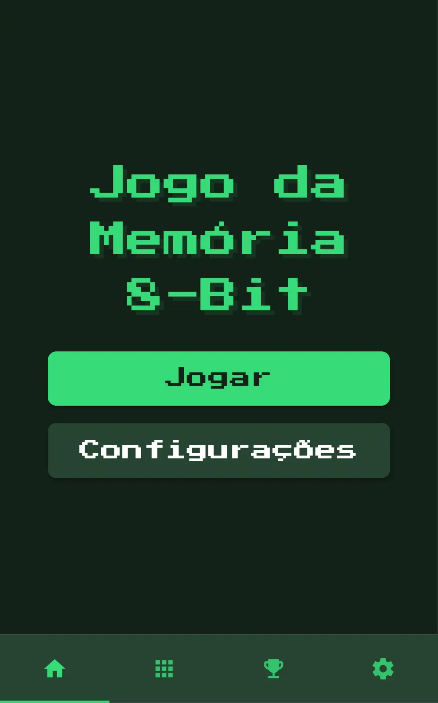
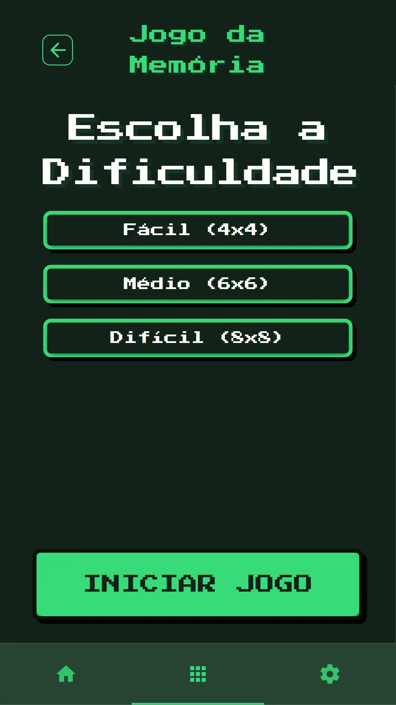
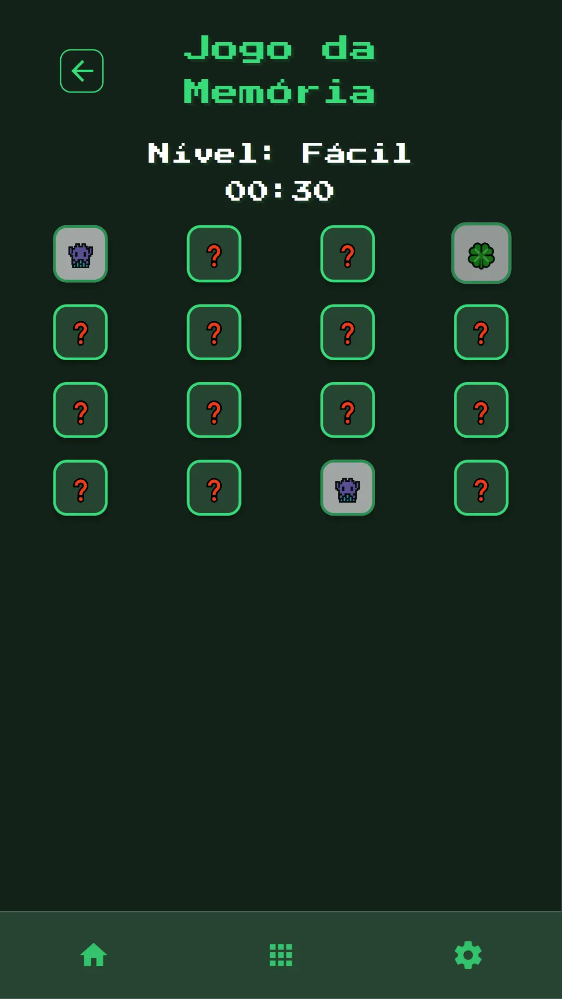

# Jogo da Memoria (Memory Game)

A simple memory game with an 8-bit theme, built using Quasar Framework.

## How to Play

- Select a difficulty level.
- Click on cards to reveal them.
- Match pairs of identical cards.
- Finish as fast as you can to get a higher score! 

## Table of Contents

- [Jogo da Memoria (Memory Game)](#jogo-da-memoria-memory-game)
- [How to Play](#how-to-play)
  - [Table of Contents](#table-of-contents)
  - [The Game](#the-game)
  - [Folder Structure](#folder-structure)
  - [Install the dependencies](#install-the-dependencies)
  - [Development Mode](#development-mode)
  - [Build the app for production](#build-the-app-for-production)
  - [Game Features](#game-features)
  - [Technologies Used](#technologies-used)
  - [Contributing](#contributing)
  - [License](#license)

## The Game

<p align="center">
    
    
    
</p>

## Folder Structure

Here's a summary of the main folders and files in the project:

```
├── public/           # Static assets (icons, screenshots, sounds)
├── src/              # Source code (components, pages, assets, etc.)
├── src-pwa/          # PWA-specific files (service worker, manifest)
├── .editorconfig     # Editor settings
├── .gitignore        # Git ignore rules
├── package.json      # Project metadata and dependencies
├── quasar.config.js  # Quasar configuration
├── README.md         # Project documentation
```

For a detailed structure, see the repository.


### Install the dependencies

```bash
yarn
# or
npm install
```

### Development Mode

- Start the app in development mode with hot-code reloading and error reporting.

```bash
quasar dev -m pwa
```

### Build the app for production

```bash
quasar build -m pwa
```

### Game Features

- **Responsive Design**: The game is designed to work on both desktop and mobile devices.
- **8-Bit Theme**: The game features an 8-bit style with pixel art graphics.
- **Soundtrack**: An 8-bit soundtrack plays in the background.
- **Sound Effects**: Sound effects for clicks.
- **Levels**: 3 levels of difficulty (Easy, Medium, Hard).
- **Score**: The score is calculated based on the time taken to complete the game.

### Technologies Used

- **Vue.js**: A progressive JavaScript framework for building user interfaces.
- **Quasar Framework**: A Vue.js framework for building responsive web applications.
- **PWA**: The game is built as a Progressive Web App, allowing it to be installed on devices and work offline.

### Contributing

If you want to contribute to this project, feel free to open an issue or submit a pull request. Contributions are welcome!

### License

This project is licensed under the MIT License - see the [LICENSE](LICENSE) file for details.
